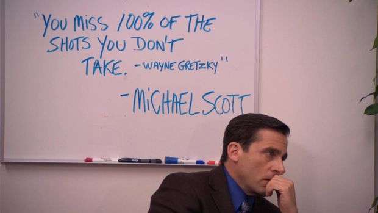

  

## About meeee ##

-----------------------
### [LINKTREE](https://linktr.ee/helloitstania) | [INSTY](https://instagram.com/myfriendtania) | [STORE](https://feelyclub.com) ### 
-----------------------

  

<!----------------------------------------- COMMENTED OUT ITEMS ------------------------------------->

<!----  ---->

<!---  --->

<!---
myfriendtania/myfriendtania is a ✨ special ✨ repository because its my `README.md` (this file) appears on your GitHub profile.
You can click the Preview link to take a look at your changes.
--->
