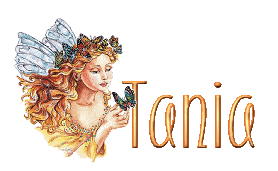

  

## Welcome to my GitHub page ##
- I started coding as a hobby when I was 15 and I changed up my friends' mySpace pages.
- My partner is [Daniel JS](danieljs.io) and he's motivated me to grow and truly embrace the world of code.
- I attended EL Centro Community College to receive and Associate's in Applied Science in Software Development.
- Looking to collaborate on growing my brand and hoping to help others with creating their websites ✨
- You can reach me at for any biz inquiries.

-----------------------
### [LINKTREE](https://linktr.ee/helloitstania) | [INSTY](https://instagram.com/myfriendtania) | [STORE](https://feelyclub.com) ### 
-----------------------

<!----------------------------------------- COMMENTED OUT ITEMS ------------------------------------->

<!----  ---->
<!---
myfriendtania/myfriendtania is a ✨ special ✨ repository because its my `README.md` (this file) appears on your GitHub profile.
You can click the Preview link to take a look at your changes.
--->
